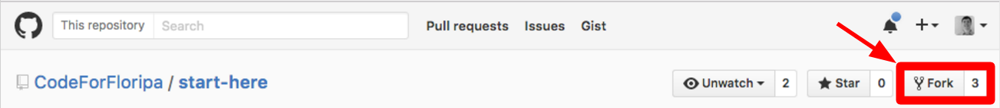
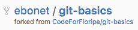
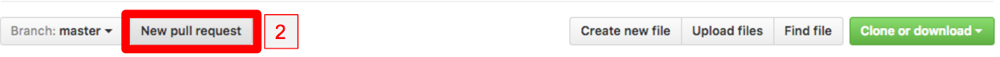
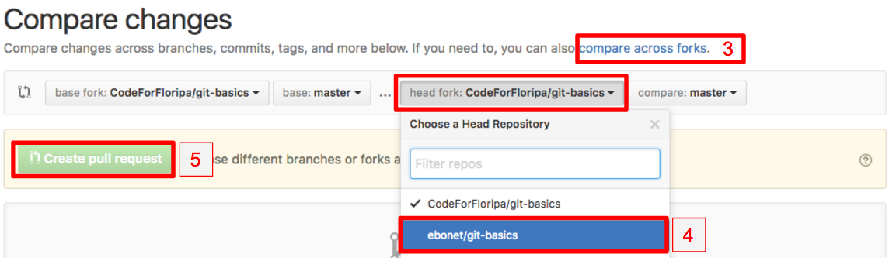

# Usando a linha de comando
Aqui, explicaremos como fazer uma contribuição usando git na linha de comando do Unix.

## Passo 1: Fazendo um fork

Depois de quer criado a sua conta gratuita no GitHub, faça um fork desse projeto. O que é um fork? Fork é como se fosse uma cópia desse repositório para sua conta. Dessa forma, você consegue modificar o código livremente sem causar problemas no código original.

Para fazer um fork, clique aqui no botão no "fork" no topo da página:



Nesse caso, meu usuário se chama ebonet. Agora você posso acessar seu repositório em github.com/seuusuario/git-basics.



Observe que embaixo do nome do projeto já é informado que o repositório na verdade é um fork de um outro. 
Para acessar o seu repositório, basta trocar ebonet pelo seu nome de usuário. 

## Passo 2: Clonando para o seu repositório

Depois do passo 1, você tem uma cópia do repositório totalmente sua, mas como editá-la? Para isso, você precisa **clonar** o projeto,
ou seja, copiar para o seu computador. Para isso, digite os seguintes comandos:

```
git clone http://github.com/{seuusuario}/git-basics
cd git-basics
```

## Passo 3: Fazendo modificações

Agora que você tem uma cópia local, você consegue editar o conteúdo.

1. Abra o arquivo [README.md](README.md). No final dele, existe uma lista de usuários.
2. Adicione ao final da lista (não se esqueça de deixar um item em branco no final):

```
* [seuusuario](github.com/seuusuario) - comando
```

## Passo 4: Fazendo um Commit

Na pasta raiz do projeto, digite

```
git status
```

Se tudo der certo, você verá que apenas o README.md foi modificado. Agora digite

```
git commit -am "Usuário adicionado ao README.md"
```

Um commit diz para o git que aquele é um ponto importante no projeto, indica um progresso. 
Porém, esse commit por enquanto só está salvo localmente. Para mandá-lo ao servidor, digite:

```
git push
```

Agora acesse a sua versão do repositório (`github.com/seuusuario/git-basics`), abra o arquivo README.md no site 
e você verá sua alteração ali \o/.

## Passo 5: Fazendo um Pull Request 

As alterações estam salvas online, porém elas foram feitas apenas no seu espelho do repositório original, 
nada foi adicionado ao repo original do CodeForFloripa. Para fazer isso, você precisa criar um PullRequest,
que é um pedido para que os membros do time aceitem sua contribuição. Para criar um PullRequest:

1. Acesse o repo original
2. Clique em `New Pull Request`
3. Clique em `Compare Across Forks`
4. Selecione o seu repositório
5. Clique em `Create Pull Request`
6. Adicione uma mensagem explicando o motivo do PullRequest e o que foi feito.
7. Clique em `Confirm`





Pronto! Agora é só esperar um membro da equipe verificar sua constribuição e adicioná-la ao repositório principal.

## Extra: Atualizando o repositório

## Extra: Lidando com conflitos de merge